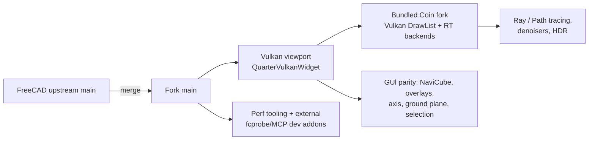
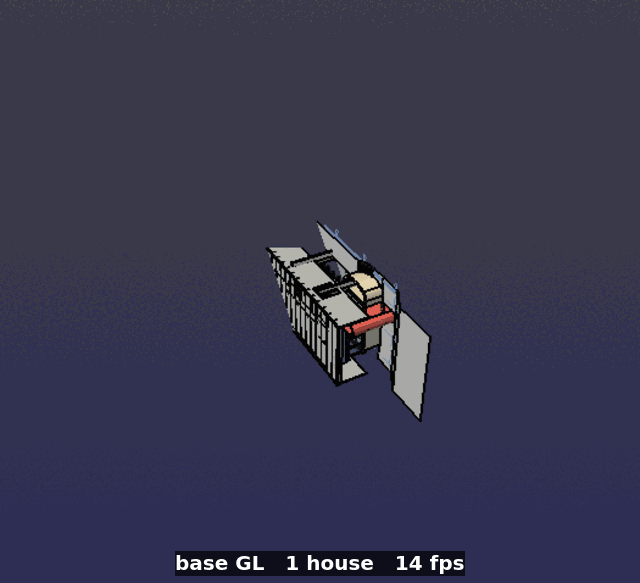
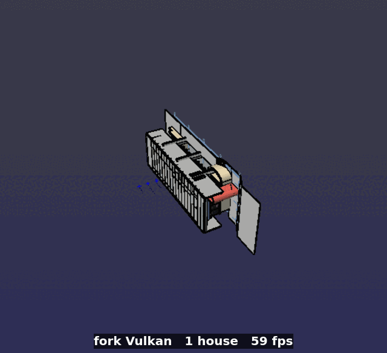
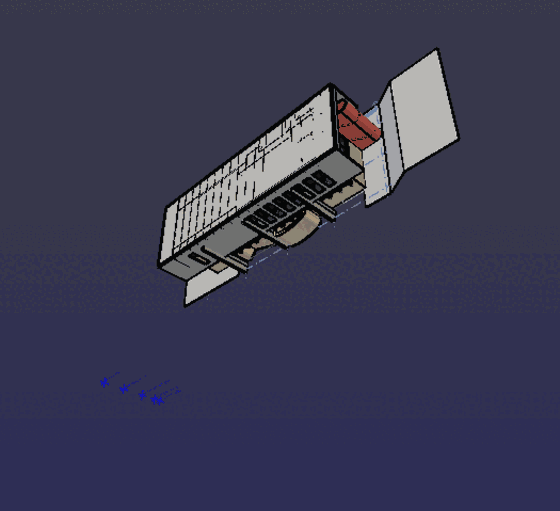

# README2 — FreeCAD Vulkan Fork: Change Report vs Upstream

A concise inventory of everything this fork changes relative to upstream
FreeCAD. Produced by scanning the fork branch and its bundled Coin submodule;
the counts are a **point-in-time snapshot** (they drift as the branch moves —
see [§13](#13-reproduce-the-change-list) for the commands to regenerate them).

## 0. Scope & statistics

| Item | Value |
| --- | --- |
| Fork remote | `git@github.com:brianmk/FreeCAD-vulkan.git` (`fork`) |
| Current branch | `feat/vulkan-present-mode` |
| Upstream merge point (merge-base) | `3471328fe9` (FreeCAD upstream, 2026-09-24) |
| Base checkout used for comparison | `FreeCAD_base/FreeCAD` @ `acdce56122` |
| Fork-only commits (incl. merges) | **413** (306 non-merge, 107 merge) |
| Fork-only diff (vs merge-base) | **490 files, +58,869 / −14,484** |
| Author of all non-merge commits | `phantomcake <brianmgs@pm.me>` |
| Bundled Coin submodule | `brianmk/coin` branch `freecad-master`, **281 fork-only commits** |

The fork keeps upstream `origin/main` as the remote, so it can be re-synced
periodically (`bf784cdc09`, `b18f4514a1`).



## 1. Bundled Coin renderer (`src/3rdParty/coin`)

The largest change is a **fork of Coin3D** pinned by `.gitmodules` to
`brianmk/coin` (`freecad-master`, 279 commits ahead of `coin3d/master`).

- New **Vulkan render backend** (`SoVulkanRenderBackend`) and DrawList backend,
  with VMA-based allocators for raster, RTX, textures, staging and CUDA interop.
- Backend decomposition, `SoVulkanGeometryCache`, FramePlan, wide-line support.
- **Ray-tracing / path-tracing** backend (`SoRTXRenderBackendCore`) with
  BLAS/TLAS management, adaptive sampling, temporal reprojection, NEE/MIS,
  BLAS refit/re-keying.
- **Denoisers**: Intel OIDN, NVIDIA RTX, AMD FidelityFX DNSR, plus None.
- **HDR output**: HDR10 (PQ), scRGB FP16 extended-linear sRGB, selectable tone
  mapping; x86/Windows `/WX` conformance fixes; reproducible SPIR-V stamps.
- Frequent submodule bumps (≈100 "Bump bundled Coin …" commits) carry these
  fixes into the build.

## 2. Vulkan viewport core (`src/Gui`)

- `Quarter/QuarterVulkanWidget.{cpp,h}` (~2.6 kLOC) — QVulkanWindow-based
  viewport: instance/device, swapchain, present, input forwarding, frame
  dumping (`VulkanFrameDumper.h`), demand-driven redraws.
- `VulkanViewportAdapter.{cpp,h}` — bridges the Coin viewer to the Vulkan
  widget; per-view pick ownership, viewport resync, camera clip refit.
- `InteractionController` + `InteractionHost`/`InteractionSurface` — single
  shared controller for input authority across GL/Vulkan views.
- `View3DInventor.cpp` opt-in integration; `View3DInventorViewer` plumbing.
- `VulkanViewSettings` + `View3DSettings` data-driven preference table.
- `GpuPickService` — GPU ray-query preselection picking.
- `Base/VulkanBreadcrumbs.h` — opt-in diagnostic tracing.
- `synchronization2` feature and barrier usage; non-Vulkan fallback paths.

## 3. Ray tracing / path tracing

- Render modes split: **RasterCoin / RasterVulkan / Wireframe / RayTracing /
  PathTracing / Environment**, with runtime RT capability detection.
- RTX phases 0–7: optional RT extensions, temporal reprojection, adaptive
  sampling + active-pixel auto-stop, NEE/MIS over emissive surfaces, BLAS
  refit/cache re-keying, device-lost handling.
- **Path Tracing Max** mode with physically-based dielectric glass; glass
  transmission fixes; IFC window transparency mapped to glass alpha.
- Hover/selection/preselection highlight rendered as an **overlay layer** so it
  no longer restarts path tracing (fixes colour bleed and re-traces).
- Cubemap environment / IBL view mode (Desk, Table, White Lab, White
  Background) and background push-path consolidation.

## 4. HDR & colour management

- `Gui/DisplayLuminance.{cpp,h}` — Wayland HDR display-luminance probe.
- HDR output modes: **HDR10 (PQ)** and **scRGB FP16** extended-linear sRGB.
- Selectable **tone-mapping operator** preference; HDR tone-map probe.
- `DlgSettings3DView.ui` exposes renderer, RT, HDR and glass options.

## 5. Rendering parity & GUI features

- **NaviCube for Vulkan** (`SoNaviCubeVulkan.{cpp,h}`) with labels, hover,
  culling, DPR/event handling.
- `SoAxisCrossOverlay`, `SoRasterOverlay`, `SoGroundPlane` (new).
- Raster overlay pass for datum/plane annotations, cursor shapes, axis cross,
  bounding boxes.
- Part shape nodes (`SoBrepFaceSet`, `SoBrepEdgeSet`, `SoBrepPointSet`,
  `SoBrepOverlayHelpers.h`): GL/IR overlay dedup, exact overlay face index,
  seam suppression, refan winding, tessellation fixes.
- Selection (`SoFCSelection`, `SoFCUnifiedSelection`, `Selection.cpp`):
  Vulkan highlight colour, per-view selection, shared render logic.
- `SoDatumLabel`, `ViewProviderDatum`/`Plane` overlay scaling by pixel ratio.

## 6. Part / display geometry (CPU + GPU)

- Async display-geometry build during document restore; faster large-shape
  geometry build; 0-node index guards.
- GPU ray-query preselection picking; `SoRayPickActionTest` /
  `VulkanSelectionTest` coverage.
- Geometry **LOD** and interaction LOD, backend-owned LOD pre-pass, pipeline
  cache persisted across runs.
- Data-race fix in parallel display-normals fill; zero-surface-normal fallback.
- Shared `PrimitiveShapes`, `CrossSectionsBase`, `ShapeSelection`,
  `BSplineCurvePyHelpers.h`.

## 7. Performance, startup & memory

- `tools/perf/` suite: `renderer_perf.py`, `renderer_scene_probe.py`,
  `sketch_perf.py`, `sketch_scene_probe.py`, `module_rollup.py`,
  `sample_flame.py` (+ `samplib.c` CPU sampler).
- Startup/restore quickening: skip full `updateView()` during restore; defer
  Draft/BIM view-provider updates; skip Draft SVG regeneration in TechDraw;
  avoid progress-bar churn while reading embedded files; memoize Draft
  face-count in `get_diffuse_color`.
- Sketcher solver: share component-graph between `initSolution` passes,
  diagnose decoupled components independently.
- Coin: retained-IR dedup, geometry-cache identity, pipeline cache, wide-line
  cache, fingerprint-walk skip.
- App/Base: thread-safe `Console` observer list; pipelined MainThreadSignal.

## 8. App / Base concurrency & correctness

- `MainThreadSignal.h`: per-signal delivery policy, deadlock-free cross-thread
  delivery (+ tests `tests/src/App/MainThreadSignal.cpp`).
- `Base/Observer.h`: thread-safe observer list (+ `tests/src/Base/Observer.cpp`).
- `--no-focus` CLI/GUI option; binary BRep save by default; safe env parsing;
  quiet unavailable-restore-module reporting; KDE warning suppression.
- Python cleanup: removed dead code, moved `MetaTypes.h` to App, App/Gui layer
  include lint (`tools/lint/app_layer_includes.py`).
- Broad Python dedup commit `614848a7a1` (Fem flow-velocity, Draft array
  panels, CAM surface/waterline, Material delegates, BIM commands).

## 9. Build system, CI & non-Vulkan guards

- Two fork-only CI workflows: `sub_buildPixiVulkan.yml`,
  `sub_buildUbuntuVulkan.yml`; pixi `PixiVulkan` environment.
- Windows Vulkan SDK install/discovery fixes; conda Vulkan headers; Pixi
  build problem-matcher and `--accept-messages` fixes.
- `FREECAD_USE_VULKAN` guard consistency across CMake, headers and bindings so
  the **non-Vulkan build stays green** (`f2b64b27cb`, `a2d3a81a34`, …).
- `tools/rendering/preci_check.py` local pre-CI validator (clang `-Werror`
  "Pixi" mode + clang-cl `/WX` "Windows" mode).
- Removed dead `SoDevicePixelRatioElement`, `DlgBlock.ui`, `ToolEditor.ui`.

## 10. Tooling

- **Assistant addon** — moved out to its own repo
  [`brianmk/FreeCAD-Assistant`](https://github.com/brianmk/FreeCAD-Assistant);
  installed as a normal user addon (in-app AI chat panel with MCP control).
- **fcprobe harness + MCP server** — moved out to their own repo
  [`brianmk/FreeCAD-DevTools`](https://github.com/brianmk/FreeCAD-DevTools)
  (`fcprobe/` unified in-GUI harness `freecad_probe.py` with 100+ Vulkan/RT
  probes, suites and golden hashes; `fcprobe/mcp/` live-FreeCAD MCP server +
  guest).  Ships as the **DevTools** workbench addon (MCP toggle + harness
  self-test); the harness locates this tree via `FREECAD_SRC`.
- **`tools/rendering/`** — `abi_sentinel.py`, `spirv_layout_check.py`,
  `check_spirv_stamps.py`, `verify_renderer.sh`, device profiles, Vulkan layer
  settings, capture runbook.

## 11. Docs & work-in-progress

- Added: `docs/vulkan-perf/` (render diagram + `perf_*.png` comparison charts),
  `PERF_COMPARISON.md` (see [§12](#12-performance-comparison)), and this
  `README2.md`.
- Removed: internal Vulkan planning/design documents, tracked `AGENTS.md`.
- The **`VulkanPresentMode`** (V-Sync) setting — FIFO/Mailbox/Immediate in
  `DlgSettings3DView.ui`/`Imp`, `VulkanViewSettings`, `QuarterVulkanWidget`
  (`priv->presentMode`) and `VulkanViewportAdapter` — is now committed
  (`1db4c44a54`, `ce412aa4a`), not work-in-progress.
- Only `FreeCAD_base/` (the upstream comparison checkout) remains untracked and
  git-ignored in spirit; it must never be committed.

## 12. Performance comparison

> The numbers in this section are **provisional/unverified**: the Vulkan side
> was measured with V-Sync disabled (Immediate, xcb) against a GL baseline on
> default pacing, so they are not apples-to-apples. See the caveat list in
> [`tools/perf/vulkan_vs_base/`](tools/perf/vulkan_vs_base/README.md).

Full report: [`PERF_COMPARISON.md`](PERF_COMPARISON.md). Charts:
[`perf_dashboard.png`](docs/vulkan-perf/perf_dashboard.png),
[`perf_throughput.png`](docs/vulkan-perf/perf_throughput.png),
[`perf_vorontest.png`](docs/vulkan-perf/perf_vorontest.png),
[`perf_startup.png`](docs/vulkan-perf/perf_startup.png),
[`perf_rotating_camera.png`](docs/vulkan-perf/perf_rotating_camera.png).

Setup: baseline `FreeCAD_base` @ `acdce56122` (`build/release`, Vulkan OFF) vs
fork `build/release-vulkan` (Release). Same probe under both. V-Sync removed
via the `VulkanPresentMode=2` (Immediate) setting; runs on **xcb** because
native Wayland's `requestUpdate()` frame-callback pacing caps frames even with
Immediate present. RTX 5090, 1600x900.

### Scene throughput (fps)

| Workload | base GL | fork GL | fork Vulkan | Vk vs base |
| --- | ---: | ---: | ---: | ---: |
| empty | 48.1 | 46.0 | **379.7** | 7.9x |
| sketches 200 | 42.1 | 42.2 | **380.7** | 9.0x |
| objects 1000 | 22.7 | 21.4 | **312.2** | 13.7x |
| objects 5000 | 6.9 | 6.9 | **211.9** | 30.8x |
| objects 15000 | 2.43 | 2.31 | **6.10** | 2.5x |

### vorontest.FCStd (44.6 MB, single huge Part)

| Config | document open | render |
| --- | ---: | ---: |
| base GL | 17618 ms | 5.5 fps |
| fork GL | 1335 ms | 46.2 fps |
| fork Vulkan | 1266 ms | **376.9 fps** |
| fork Vulkan path-trace | 1310 ms | 356.0 fps |

Async display-geometry during restore opens the huge document ~13x faster;
Vulkan renders it ~68x faster.

### Startup & cube open (xcb, median of 5)

| Config | startup incl. logo | open cube | launch → cube |
| --- | ---: | ---: | ---: |
| base GL | 2111 ms | 122.7 ms | 3707 ms |
| fork GL | 2166 ms | 134.8 ms | 3793 ms |
| fork Vulkan | 2145 ms | 217.7 ms | 4544 ms |

Startup with splash/logo is unchanged; the first Vulkan open adds ~95 ms of
device/swapchain setup.

### Rotating camera, 1000 boxes

| Render mode | fps |
| --- | ---: |
| base GL | 22.1 |
| fork GL | 21.8 |
| fork Vulkan raster | **74.3** |
| fork Vulkan ray-trace | 71.0 |
| fork Vulkan path-trace | 68.5 |
| fork Vulkan environment | 72.6 |

Path tracing: 68.5 fps rotating (1000 boxes), 350 fps static (250 boxes).

**Takeaways:** Vulkan 8x–31x faster than upstream GL on ordinary scenes, 68x on
the 44 MB model; huge-document open ~13x faster; GL parity preserved (±6%);
startup unchanged; RT modes within ~8% of raster.

### Demo GIFs

Camera flying around the BIMExample house, cloned into **8 houses mid-animation**
and then **doubled to 16 near the end** (separated, no collision) — the fluidity
difference is visible (base GL ~10 fps vs fork Vulkan ~33 fps; model edges enabled
on both, Vulkan via the black edge overlay):

| upstream base GL | fork Vulkan (Immediate) |
| :---: | :---: |
|  |  |

Raster Vulkan → **Path Tracing Max** (mode 6) on `BIMExample.FCStd`; the camera
flies in and the path tracer converges (RTX/OptiX denoiser):



## 13. Reproduce the change list

```sh
# fork-only commits / diff against the exact upstream merge point
MB=$(git merge-base HEAD origin/main)
git rev-list --count "$MB"..HEAD              # 413 (incl. merges)
git rev-list --no-merges --count "$MB"..HEAD  # 306
git diff --shortstat "$MB"..HEAD

# bundled Coin fork delta
git -C src/3rdParty/coin rev-list --count coin3d/master..HEAD
```

## 14. AI provenance & disclosure

This fork was developed with substantial AI assistance. Upstream
[`AI_POLICY.md`](AI_POLICY.md) requires disclosure of AI assistance and expects
an `Assisted-by: [Model-Family] ([Version/ID])` trailer on the commits that
used it. The fork currently falls well short of that:

| Metric | Value |
| --- | --- |
| Fork-only non-merge commits | 306 |
| …carrying any `Assisted-by:`/`Co-authored-by:` trailer | 8 |
| …carrying an actual `Assisted-by:` disclosure | 4 |

The history is **not being rewritten** to retrofit trailers (that would change
every fork commit hash and the PR stack). Instead: the gap is acknowledged
here, and new commits should carry an `Assisted-by:` trailer as the policy
requires. Contributors must, per the policy, fully understand and take
responsibility for the code they submit.

## 15. Quality hardening (2026-09-26)

A review pass tightened several product-quality concerns flagged on the fork:

- **Qt private API coupling (present mode).** Reaching
  `QVulkanWindowPrivate::presentMode` is now an explicit build opt-in,
  `FREECAD_USE_QT_PRIVATE_PRESENT_MODE` (default ON only where the Qt6
  `GuiPrivate` headers exist; `-D…=ON/OFF` to choose). A runtime tripwire
  refuses to write if the private struct no longer looks like the one the code
  was written against, and the preference degrades to FIFO with a log message
  when compiled out.
- **Portable HDR driver detection.** The known-bad NVIDIA `610.x` gate now
  reads the Vulkan physical-device properties (`vendorID` / `driverVersion`)
  when available, is scoped to Wayland (where the WSI bug exists) instead of
  all of Linux, and falls back to `/proc/driver/nvidia/version` only before the
  device exists. The `FREECAD_VULKAN_HDR_FORCE_BLOCK_DRIVER` test hook is
  compiled out without `FREECAD_VULKAN_DEBUG_HOOKS`.
- **Instrumentation out of product builds.** `Base/VulkanBreadcrumbs.h` now
  compiles its file I/O entirely only with `FREECAD_VULKAN_DEBUG_HOOKS`
  (defined directory-wide for Debug and for
  `-DFREECAD_USE_VULKAN_DEBUG_HOOKS=ON`). In other builds the `VK_BREADCRUMB*`
  macros are no-ops and the diagnostic env hooks (`FC_PICK_PROBE`,
  `FC_RASTER_OVERLAY_OFF`, `FC_LIGHT_TRACE`, `FC_VULKAN_AXIS_DEBUG`,
  `FC_SKIP_UNSAVED_PROMPT`, `FREECAD_NAVICUBE_PICK_*`, …) are not compiled in.
- **Upstream test adaptation.** `parttests/ColorPerFaceTest.py` no longer
  toggles `Visibility` to force a synchronous geometry rebuild; it pumps the
  GUI event loop until the async display geometry lands, without changing
  document state.
- **Benchmarks committed and labelled.** The Vulkan-vs-base drivers are now in
  [`tools/perf/vulkan_vs_base/`](tools/perf/vulkan_vs_base/), and
  [`PERF_COMPARISON.md`](PERF_COMPARISON.md) marks its numbers provisional
  (the Vulkan side was measured with V-Sync disabled against a paced GL
  baseline).
