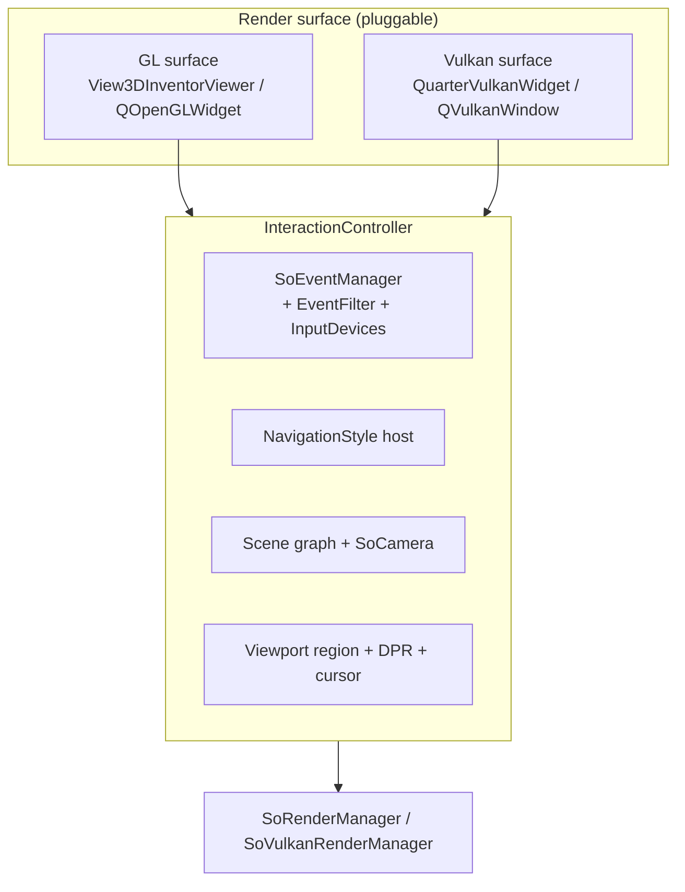

# Vulkan interaction authority — design

Status: **Phase 0–5 implemented, including the surface swap** (the controller
runs on a Vulkan `InteractionSurface` while that page is current; the
render-manager region/DPR sync is retained for the GL/IR render path; see §9).
Tracks the
"Hidden GL viewer as interaction authority" item in
[ARCHITECTURE.md](ARCHITECTURE.md) §8.

## 1. Problem

The Vulkan viewport is a **display-only** surface.  `QuarterVulkanWidget`
(`src/Gui/Quarter/QuarterVulkanWidget.{h,cpp}`) has no event manager, no
navigation style, no scene graph of its own and no viewport region; it relays
every mouse/wheel/key/tablet/touch event to the hidden `View3DInventorViewer`
via `setEventForwardTarget()`
(`src/Gui/VulkanViewportAdapter.cpp:122`, forwarding in
`QuarterVulkanWidget.cpp:2108-2204`).  Navigation and picking therefore run on
a widget that never renders, and the two viewports' coordinate systems are kept
in lockstep by hand (`VulkanViewportAdapter::applySurfaceViewportToGL`,
`VulkanViewportAdapter.cpp:741-817`).

The costs are structural:

- Every viewport feature (navigation, NaviCube, editing, lasso, sketcher drag,
  selection) must work in the GL viewer even when it is never painted.
- The Vulkan surface size, Y-flip, device-pixel ratio and pick radius are
  reconciled by a web of hand-sync code, each a source of subtle drift.
- GPU picking already exists for the RTX backend
  (`QuarterVulkanWidget::pickRay` → `SoRTXRenderBackendPick.cpp`) but is only a
  per-node accelerator registered while the Vulkan page is current
  (`VulkanViewportAdapter.cpp:206-229`).

## 2. Current architecture

### Widget / page structure

```
View3DInventor
 ├─ QStackedWidget
 │   ├─ page 0: View3DInventorViewer->getWidget()   (hidden GL viewer)
 │   └─ page 1: QuarterVulkanWidget                  (Vulkan surface)
 └─ VulkanViewportAdapter  (owns both, switches pages)
```

- `View3DInventorViewer : Quarter::SoQTQuarterAdaptor : QuarterWidget :
  QGraphicsView` (`View3DInventorViewer.h:127`, `SoQTQuarterAdaptor.h:72`,
  `QuarterWidget.h:62`).
- Page switch: `View3DInventor::setRenderMode()` →
  `VulkanViewportAdapter::useVulkanViewport()` (`View3DInventor.cpp:491`,
  `VulkanViewportAdapter.cpp:278`).
- While the Vulkan page is current the GL page is a non-current stack page, so
  the `QOpenGLWidget` viewport never paints
  (`QuarterVulkanWidget.cpp:419-425`).

### Event flow (today)

```
Qt event → QuarterVulkanWidget::eventFilter (QuarterVulkanWidget.cpp:2108)
        → QCoreApplication::sendEvent(forwardTarget = GL viewer)
        → Quarter::EventFilter (QuarterWidget.cpp:303)
        → InputDevice::translateEvent (Mouse.cpp:146-251)
        → View3DInventorViewer::processSoEvent (View3DInventorViewer.cpp:3748)
             ├─ NaviCube::processSoEvent
             ├─ navigation->processEvent → NavigationStyle::processSoEvent
             └─ processSoEventBase → QuarterWidget::processSoEvent
                  → SoEventManager::processEvent → SoHandleEventAction
                       → SoFCUnifiedSelection::handleEvent → SoRayPickAction
```

### Ownership today

| Concern | Owner |
|---|---|
| `SoEventManager`, `EventFilter` | `QuarterWidget` (`QuarterWidget.cpp:271,277`) |
| Scene graph + `SoCamera` | `QuarterWidget::setSceneGraph` superscene (`QuarterWidget.cpp:657-673`) |
| `NavigationStyle` | `View3DInventorViewer` (`View3DInventorViewer.cpp:1518`, member `:771`) |
| `processSoEvent` / naviCube | `View3DInventorViewer` (`:3748`) |
| `pickPoint` / `getPointOnRay` | `View3DInventorViewer` (`:4301`, `:1774`) |
| Selection nodes (`SoFCUnifiedSelection`) | GL viewer scene graph (`View3DInventorViewer.cpp:1254`) |
| Viewport region / DPR | GL viewer, synced from Vulkan by `VulkanViewportAdapter` (`:741-817`) |
| Cursor | surface-owned: `View3DInventorViewer::setCursorTarget()` points at the visible surface (Vulkan container or GL widget), set by `VulkanViewportAdapter::useVulkanViewport()` |
| Change detection | adapter `SoNodeSensor`s (`VulkanViewportAdapter.cpp:592-631`) + revision hash (`QuarterVulkanWidget.cpp:78-98`) |

### Key coupling facts

- **The camera is shared, not owned by the Vulkan widget.**  It is a node in
  the GL viewer's superscene; `QuarterVulkanWidget::setCamera` is handed the
  pointer (`VulkanViewportAdapter.cpp:162`) and the render manager re-resolves
  it from the shared graph each frame (`SoVulkanRenderManager.cpp:1357-1425`).
- **`SoRayPickAction` is CPU-only** — no OpenGL context is involved.  The
  blocker for moving picking is object ownership (event manager + selection
  nodes), not a graphics dependency.
- **`NavigationStyle` is not standalone.**  It stores a
  `View3DInventorViewer*` (`NavigationStyle.h:404`) and reaches through it for
  the camera/render manager (`NavigationStyle.cpp:625-628`), the event base
  callback (`CADNavigationStyle.cpp:73`), editing state, viewport region and
  pick radius.  There is no abstract host interface.
- **Auto-clipping is asymmetric.**  The hidden GL viewer's render-manager
  auto-clipping never runs; the Vulkan manager does its own
  (`QuarterVulkanWidget.cpp:512-519`).  Picking uses the shared camera's
  near/far, so the two must stay in lockstep.

## 3. Target architecture

Introduce a single **interaction controller** that owns the event pipeline and
navigation, parameterised by the render surface.  The GL viewer and the Vulkan
widget both drive it; only the surface (viewport region, DPR, cursor, redraw)
differs.  The hidden GL viewer becomes optional and can eventually be removed
from the Vulkan path.



The `SoCamera` and scene graph move to the controller (or to a
surface-independent owner shared by both), so both surfaces observe the same
camera and viewport region.  `NavigationStyle` depends on an
`InteractionHost` interface implemented by the controller, not on
`View3DInventorViewer`.

## 4. Ownership moves

| Concern | Today | Target |
|---|---|---|
| `SoEventManager` / `EventFilter` | `QuarterWidget` | `InteractionController` |
| Scene graph + `SoCamera` | `QuarterWidget` superscene | `InteractionController` (shared) |
| `NavigationStyle` host | `View3DInventorViewer` | `InteractionHost` interface |
| `processSoEvent` dispatch | `View3DInventorViewer` | `InteractionController` |
| Picking (`SoRayPickAction`) | GL `SoEventManager` | `InteractionController` (surface-independent) |
| Viewport region / DPR | GL viewer + hand-sync | surface reports one canonical region |
| Cursor | GL widget + mirror | surface-owned via the controller |
| Change detection | adapter sensors | controller / shared scene |

## 5. Migration phases

Each phase must build, keep the GL path working, and be independently
verifiable.  Do not start a phase before the previous one is green.

### Phase 0 — baseline and guardrails
- Capture the current behaviour: navigation (orbit/pan/zoom), click-select,
  hover highlight, NaviCube, editing entry/exit, lasso, on both `RasterCoin`
  (GL) and Vulkan render modes.
- Add a probe that records the camera pose and selection after a scripted
  input sequence, so later phases can diff against the baseline.

### Phase 1 — `InteractionHost` interface for `NavigationStyle` (prerequisite)
- Extract an abstract `InteractionHost` (camera/render-manager access,
  viewport region, pick radius, editing state, `processSoEventBase`, cursor,
  redraw) from the members `NavigationStyle` uses
  (`NavigationStyle.h:404`, `NavigationStyle.cpp:625-628`).
- `View3DInventorViewer` implements it; each `NavigationStyle` subclass
  (`src/Gui/Navigation/*`) switches to the interface.  Mechanical, ~10 styles.
- No behaviour change; verified by Phase 0's probe.

### Phase 2 — extract the interaction controller
- Move `SoEventManager`, `EventFilter`, `InputDevice`s, `processSoEvent`,
  scene graph + camera and viewport-region ownership out of `QuarterWidget` /
  `View3DInventorViewer` into an `InteractionController` that both widgets
  instantiate.
- `View3DInventorViewer` becomes a thin surface that owns an
  `InteractionController`.  GL path unchanged behaviourally.
- Verified by the probe (camera pose + selection identical).

### Phase 3 — Vulkan surface drives the controller (picking first)
- `QuarterVulkanWidget` instantiates an `InteractionController` against the
  shared scene graph + camera and reports its canonical viewport region / DPR.
- Run `SoRayPickAction` + selection handling from the Vulkan surface (CPU path
  first; wire the existing `pickRay` GPU accelerator through the same
  `GpuPickService` seam).  Navigation may still be forwarded temporarily.
- Verify: click-select and hover from the Vulkan page without the GL event
  manager.

### Phase 4 — Vulkan surface owns navigation
- Run `NavigationStyle` from the Vulkan surface via the `InteractionHost`.
- Remove the `applySurfaceViewportToGL` hand-sync for the Vulkan path once the
  controller owns the region.
- Verify: orbit/pan/zoom, NaviCube, editing, lasso, sketcher drag on Vulkan.

### Phase 5 — delete the bridge
- Remove `QuarterVulkanWidget::setEventForwardTarget` / the forwarding
  `eventFilter`, the adapter's forward-target wiring, cursor mirroring and the
  GL-page viewport sync.  The GL viewer becomes optional on the Vulkan path.
- Update ARCHITECTURE.md §8 and the layering diagram.

## 6. Verification per phase

- Phase 1–2: camera pose + selection probe unchanged on the GL path.
- Phase 3: click-select + hover on the Vulkan page; existing `pickRay` tests.
- Phase 4: navigation probe on the Vulkan page (camera pose deltas).
- Phase 5: no forward-target code paths remain; grep guard for
  `setEventForwardTarget`.

Use the existing `freecad-testing` / `fcprobe` harness for scripted input and
viewport traces.

## 7. Risks and blockers

1. **Camera/scene ownership** — the camera is a shared superscene node; moving
   authority is a wiring refactor, not a data move.  Get this wrong and both
   surfaces disagree on near/far (auto-clipping asymmetry, §2).
2. **`NavigationStyle` coupling** — 10+ subclasses reach into
   `View3DInventorViewer`; the interface must cover every access or the
   migration stalls halfway.
3. **Selection node ownership** — `SoFCUnifiedSelection` lives in the GL scene
   graph; the controller must own the scene graph (or a shared selection root)
   for picking to move.
4. **Coordinate systems** — collapsing the hand-sync into one canonical
   viewport region is the highest-value but highest-risk part; Y-flip and DPR
   bugs are easy to introduce and hard to see.
5. **Two render stacks** — raster vs RT formats/caches differ (ARCHITECTURE §8);
   the interaction controller must stay renderer-agnostic.
6. **Behaviour parity** — every feature currently works through the GL path;
   each phase must not regress it while the Vulkan path is brought up.

## 8. Out of scope

- Removing the GL viewer entirely (it remains the fallback for `RasterCoin` and
  for hardware without Vulkan).
- The two-geometry-stacks and `SoVulkanDevice` items (separate §8 debt).

## 9. Implementation status

### Phase 0 — baseline probe (done)

`tools/fcprobe/vk_interaction_probe.py` (+ `.check.py`) runs a fixed scripted
sequence — click-select, orbit (shift+right drag), pan (middle drag) — on either
surface (`FC_INTERACTION_RENDER=gl|vulkan`) and records the camera pose and
selection per phase as `[HARNESS] interaction` records.  The host check asserts
the click selected the box, the orbit changed the camera orientation and the pan
changed the camera position, so a refactor that silently drops events fails the
run instead of recording a flat baseline.

Both surfaces pass, with near-identical poses after each step (the residual is
the synthetic-input timing), e.g. after orbit
GL `pos=[8.12882,2.497724,9.915652]` vs Vulkan
`pos=[8.12528,2.499655,9.918381]`.

### Phase 1 — `InteractionHost` (done)

`src/Gui/InteractionHost.h` is the abstract, surface-independent host.
`View3DInventorViewer` implements it by forwarding to the Quarter base or to its
own state; the explicit overrides (and the `getObjectGroup()` /
`getForegroundRoot()` / `bindMouseSelection()` accessors) resolve the
same-named-accessor ambiguity and keep `NavigationStyle` from naming
`View3DInventorViewer` or `MouseSelection`'s `View3DInventorViewer`-typed
`grabMouseModel()`.

`NavigationStyle::viewer` is now `InteractionHost*`; every navigation style
(`src/Gui/Navigation/*`) drives the interface.  Behaviour is unchanged — the GL
path still runs on the same `View3DInventorViewer` — and the Phase 0 probe is
the regression guard.  Verified: `FreeCADGui`, `FreeCADMain` and `PartGui`
build, and the probe passes on GL and Vulkan.

### Phase 2 — `InteractionController` (controller + dispatch done)

`src/Gui/InteractionController.{h,cpp}` owns the navigation style and the
`processSoEvent` dispatch that used to live in
`View3DInventorViewer::processSoEvent()` (NaviCube overlay, redirect-to-scene-
graph, ESC/Q filtering, in-place camera-move detection).  It implements
`InteractionHost` by forwarding the surface-independent queries to an
`InteractionSurface` (`src/Gui/InteractionSurface.h`) — `InteractionHost` plus
the surface-owned overlay/redirect/camera-moved hooks.  `View3DInventorViewer`
is now an `InteractionSurface` that owns the controller
(`interactionController`), and forwards `setNavigationType()` /
`navigationStyle()` / `processSoEvent()` to it.

The Phase 0 probe records **identical** camera poses to the Phase 1 baseline on
both surfaces (GL after orbit `[8.12882,2.497724,9.915652]`, Vulkan
`[8.12528,2.499655,9.918381]`), so the extraction is behaviour-preserving.

The Coin interaction authority also moved: `InteractionController` now creates
and owns the `SoEventManager` (the scene-graph event dispatch + picking
pipeline) and lends it to the surface via `InteractionSurface::
surfaceSetEventManager()`.  `QuarterWidget` used to create and own that manager;
`setSceneGraph()` is now null-safe because the manager can be detached before
the widget's base destructor runs.  The controller detaches it first, so the
surface never reaches a freed manager during teardown (verified: both probe runs
exit 0, no signal).

Still to do for the full Phase 2 ownership move: relocate `EventFilter` /
`InputDevice`s (the Qt→Coin translation, which is naturally a surface concern)
and scene-graph/camera/render-manager ownership out of `QuarterWidget`.  Those
are a broad refactor of the vendored Quarter library and are deliberately left
as a follow-up so each step stays independently verifiable.

### Phase 2c — surface-agnostic input devices (done)

`src/Gui/Quarter/InputDeviceHost.h` is the minimal host a Qt→Coin device needs
(device pixel ratio, device-pixel flag, widget size, normalization window size,
and a `processSoEvent()` sink).  `InputDevice`, `Mouse`, `Keyboard` and
`EventFilter` now take an `InputDeviceHost*` instead of a `QuarterWidget*`, and
`QuarterWidget` implements it.  This is what lets the Vulkan widget translate
its own input instead of forwarding every event to the hidden GL viewer.

### Phase 3 — Vulkan reports the canonical region (done)

`InteractionController` can own a canonical viewport region + device pixel
ratio (`setViewportRegion()`); it stores it, returns it from
`InteractionHost::getViewportRegion()` and pushes it into the controller-owned
event manager so `SoHandleEventAction` picks in the same space.
`VulkanViewportAdapter::applySurfaceViewportToGL()` reports the Vulkan surface
size there.  Navigation styles now read `viewer->getViewportRegion()` instead
of `viewer->getSoRenderManager()->getViewportRegion()` (34 call sites), so
navigation/picking consult the controller's canonical region.

### Phase 4 — Vulkan surface drives the controller (done)

`QuarterVulkanWidget` is now an `InputDeviceHost`: it owns a Coin `EventFilter`
(installed on its container/window), translates mouse/wheel/keyboard events
against its own surface, and delivers them through `setEventSink()`.
`VulkanViewportAdapter` wires that sink to
`View3DInventorViewer::getInteractionController()->processSoEvent()`, so
click-select, orbit and pan run on the shared controller from the Vulkan
surface.  Tablet/touch/context-menu events are not translated by the Coin
devices and are still relayed to the GL viewer (which owns FreeCAD's gesture
devices) via `setRawEventTarget()`.

### Phase 5 — delete the forward bridge (done, with one caveat)

`QuarterVulkanWidget::setEventForwardTarget()` and the raw mouse/wheel/key
forwarding in its `eventFilter` are gone; there are no
`setEventForwardTarget` references left in the source.  The interaction path no
longer depends on the hidden GL viewer's event manager.

Cursor shapes are **surface-owned**: navigation calls
`InteractionSurface::setCursorRepresentation()`, and `View3DInventorViewer`
applies it to `cursorTarget` (`setCursorTarget()`), which
`VulkanViewportAdapter::useVulkanViewport()` points at the visible Vulkan
container (or back at the GL widget on the GL page).  The adapter's
`CursorChange` mirroring is gone.

The controller's **surface is swapped** to the Vulkan surface while its page is
current: `VulkanViewportAdapter` implements `InteractionSurface` and
`useVulkanViewport()` calls `InteractionController::setSurface()`.  The adapter
delegates every surface-independent call back to the GL viewer, but owns the
two presentation differences — `getGLWidget()` (context menus parent to the
visible container) and `scheduleRedraw()` (wakes a Vulkan frame) — and forwards
`surfaceSetEventManager()` to the GL viewer so the Coin event manager stays on
the base surface.  The adapter's destructor restores the GL surface (it is
deleted before the viewer).

The one remaining piece of the original bridge is the render-manager
region/DPR sync in `applySurfaceViewportToGL()`.  It is kept deliberately: it
is the hidden GL render path's (IR/overlay, line widths) viewport region and
its DPR, which the controller's canonical region does not replace.  It is no
longer needed to make navigation/picking work.

### Verification

`tools/fcprobe/freecad_probe.py run tools/fcprobe/vk_interaction_probe.py`
passes on both `--profile gl` and `--profile vulkan`, with identical camera
poses to the Phase 1 baseline and a clean exit (no signal).  `FreeCADGui`,
`FreeCADMain`, `PartGui` and `TechDrawGui` build.


